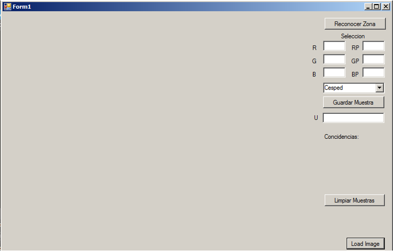
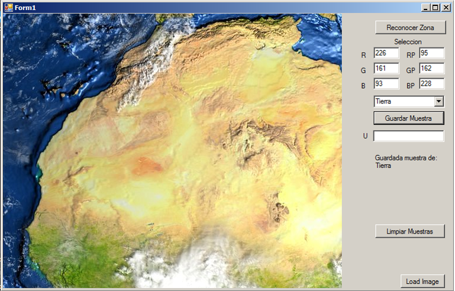
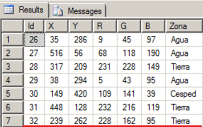

# Clasificación de Texturas

Aplicación desarrollada en C# que permite clasificar superficies como césped, tierra, cemento, asfalto y agua mediante el análisis de características de color RGB y comparación mediante distancia euclidiana.

## Tecnologías utilizadas

- C#
- Windows Forms
- Microsoft Visual Studio 2012
- SQL Server
- ADO.NET

## Requisitos

- Windows
- Microsoft Visual Studio 2012 o superior
- SQL Server

## Estructura de la base de datos

Crear la base de datos:

```sql
CREATE DATABASE multimedia;
```

La aplicación crea automáticamente la tabla durante la ejecución. En caso de requerir una creación manual, utilizar:

```sql
CREATE TABLE MuestrasTextura (
    Id INT IDENTITY(1,1) PRIMARY KEY,
    X INT,
    Y INT,
    R INT,
    G INT,
    B INT,
    Zona VARCHAR(50)
);
```

## Instalación

1. Clonar el repositorio:

```bash
git clone https://github.com/sergioapazaf-debug/clasificacion-texturas-csharp.git
```

2. Abrir la solución en Visual Studio.

3. Verificar la configuración de conexión en el archivo `TexturaBD.cs`:

```csharp
private const string SERVIDOR = "(local)";
private const string USUARIO = "user";
private const string PASSWORD = "123456";
private const string BASE_DATOS = "multimedia";
```

4. Compilar el proyecto.

## Ejecución

1. Ejecutar la aplicación.
2. Cargar una imagen mediante el botón correspondiente.
3. Seleccionar una región de la imagen.
4. Registrar muestras de textura indicando la categoría.
5. Utilizar la opción de reconocimiento para clasificar nuevas texturas.

## Categorías utilizadas

- Césped
- Tierra
- Cemento
- Asfalto
- Agua

## Capturas

### Interfaz principal



### Registro de muestras




### Resultado de clasificación


## Autor

Sergio Apaza